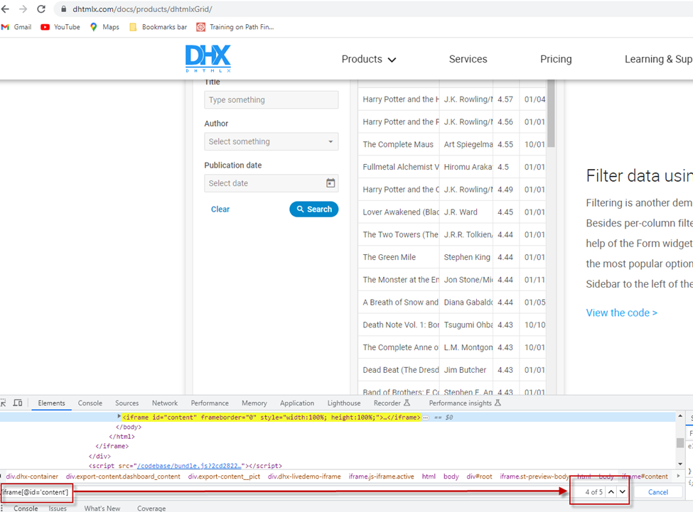
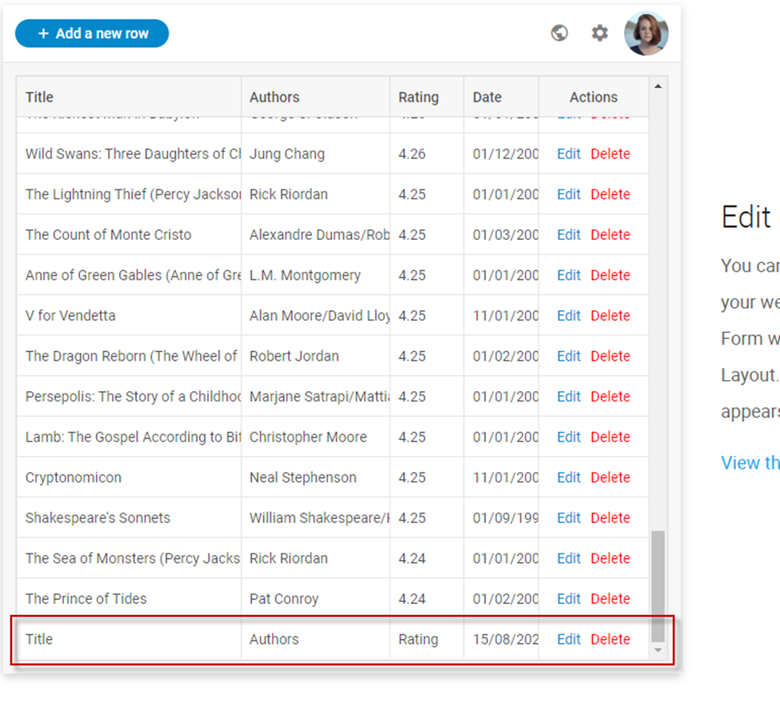

# Project: Interacting with web elements within sub sub iframe which parent is iframe on the page with many iframes without unique ids or names (Selenium Webdriver & Python)


## Description: 
This project is aiming on finding an approach to intteraction with a web elements inside of sub sub iframe that situated within a page with other iframes without unique names or ids.
The goal for this project is to use Selenium Webdriver and Python without creating a POM framework and distinct functions.

### Tasks for this project: 

1)  Navigate to page https://dhtmlx.com/docs/products/dhtmlxGrid/
2)	Navigate to a first table
3)	Click button “Add new row”
4)	When the form for a new row was opened, we want to fill data into the input fields, select date from the pop up day picker and click apply button.
5)	Verify that row was added to the table

The problem is that the table we need to interact with is situated within sub subframe and we cannot interact with it without switching to the correct iframe. If we look for “//iframe” tag on the console we’ll find out that there are 22 iframes on the page (Including sub iframes). Not all those iframes are on the top level, some of them are sub and sub sub iframes. 

Iframes of top level have no unique id or names. So, we’ll have to use their number. We need to pickup all iframes of top level and loop through them to find needed element. This method is reliable but a bit slow as it has to go over all the iframes until it finds the correct one. We can use this method as a reusable which will make it universal and applicable to any element we decide to work with. In this case we could actually simplify it by using its number as we know it won’t change as iframes aren't dynamic. The number of iframe is 2 and we may use number 1 in self.driver.switch_to.frame(1)

Then we know that table of our interest is within sub sub iframe and for that we need to switch to iframe two times in self.driver.switch_to.frame(0) and in self.driver.switch_to.frame(“content”) as sub iframes are the only internal iframes. The iframe of interest has id which is unique for this sub iframe because it’s the only one and we can easily use it. By the way there are 5 tables on the page within iframes with the same id – “content”.  


When we switch to final iframe with id “content” we can finally work with elements. 

First we’ll verify that table is correct by finding unique element on the table. 

Then we’ll click on the add new row button and fill in the input fields on the form.

Then pick up a date on the date picker. It shouldn’t be something specific, just a date, the picker has no validation so it can be even future date.
Then we’ll click apply button and verify that new row was successfully added.


### Conclusion:
We have run our test. It can be easily converted into POM test framework with python & pytest, also logger can be added and test report generated. 

### How to run the script:
1. Install [Python](https://www.python.org/)
2. Install Selenium from command line
```pip install selenium```
   
3. Install browser driver and add its directory to system variable path
4. Run script from its directory by running command
```python subframe_selenium_project.py```
